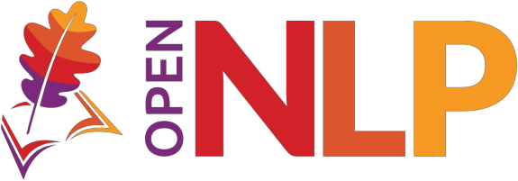

<!--
Licensed to the Apache Software Foundation (ASF) under one or more
contributor license agreements. See the NOTICE file distributed with
this work for additional information regarding copyright ownership.
The ASF licenses this file to You under the Apache License, Version 2.0
(the "License"); you may not use this file except in compliance with
the License. You may obtain a copy of the License at

    http://www.apache.org/licenses/LICENSE-2.0

Unless required by applicable law or agreed to in writing, software
distributed under the License is distributed on an "AS IS" BASIS,
WITHOUT WARRANTIES OR CONDITIONS OF ANY KIND, either express or implied.
See the License for the specific language governing permissions and
limitations under the License.
-->

# Apache OpenNLP Add-ons



[](https://github.com/apache/opennlp-addons/actions)
[](https://github.com/apache/opennlp-addons/graphs/contributors)
[](https://github.com/apache/opennlp-addons/pulls)
[](https://stackoverflow.com/questions/tagged/opennlp)

Apache OpenNLP Add-ons provides optional Java components that build on the
OpenNLP API. Each add-on is a separate Maven artifact, so applications select
only the integrations they use.

## Add-ons

| Artifact | Purpose |
| --- | --- |
| `geoentitylinker` | Geographic entity detection and linking |
| `japanese` | Features for Japanese text processing |
| `liblinear` | LIBLINEAR integration |
| `modelbuilder` | Utilities for building OpenNLP models |

## Using an add-on

Depend on the module artifact, not the parent `opennlp-addons` POM:

```xml
<dependency>
  <groupId>org.apache.opennlp.addons</groupId>
  <artifactId>japanese</artifactId>
  <version>${opennlp-addons.version}</version>
</dependency>
```

The current revamp work targets regular Maven Central releases. Until a 3.x
add-ons release is published, build the repository locally before using its
artifacts.

## Building

The build requires JDK 21 or newer and Maven 3.9.6 or newer:

```bash
mvn clean verify -Dopennlp.forkCount=1
```

Generate the DocBook manual:

```bash
mvn -pl opennlp-addons-docs -am package -Dopennlp.forkCount=1
```

The generated HTML manual is
`opennlp-addons-docs/target/docbkx/html/opennlp-addons.html` and the PDF is
`opennlp-addons-docs/target/docbkx/pdf/opennlp-addons.pdf`. Its sources are
under [`opennlp-addons-docs/src/docbkx`](opennlp-addons-docs/src/docbkx).

Verification runs OpenNLP's Checkstyle rules, forbidden API checks, tests,
RAT license-header checks, and a dependency-license report. Use `-Pjacoco`
to generate coverage reports.

## Maven publication

Artifacts use the `org.apache.opennlp.addons` group. The ASF parent POM
provides Apache staging and snapshot repository settings and the
`apache-release` profile for source archives, SHA-512 checksums, and signatures.
Deployment is disabled in this branch's POM. CI only builds and checks files.

Inspect release packaging locally without signing or uploading:

```bash
mvn clean verify -Papache-release -Dgpg.skip=true -Dopennlp.forkCount=1
```

This produces unsigned test artifacts, not an Apache release. Enabling
publication requires a reviewed build change and the Apache release process.
See the manual's
[`Maven publication` section](opennlp-addons-docs/src/docbkx/building.xml).

## Project links

- [OpenNLP website](https://opennlp.apache.org/)
- [OpenNLP documentation](https://opennlp.apache.org/docs/)
- [OpenNLP models](https://opennlp.apache.org/models.html)
- [Mailing lists](https://opennlp.apache.org/mailing-lists.html)
- [Contributing guide](https://github.com/apache/opennlp/blob/main/.github/CONTRIBUTING.md)
